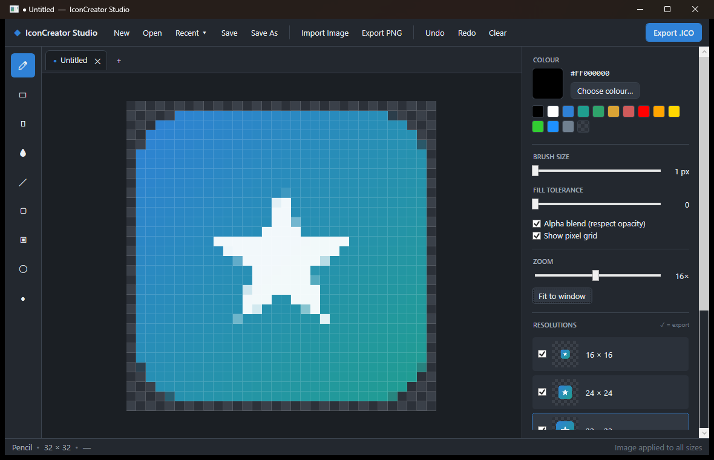

# IconCreator Studio

A professional multi-resolution icon editor for Windows — a modern, cleaner alternative to Axialis IconWorkshop. Built with **C# / .NET 9 / WPF**.



## Why it's better

| | IconCreator Studio | Axialis IconWorkshop |
|---|---|---|
| Price | Free & open | Paid licence |
| UI | Modern dark, DPI-aware | Dated |
| Multi-resolution `.ico` | ✅ 16 → 256 px in one file | ✅ |
| Live per-size thumbnails | ✅ update as you draw | Partial |
| Import any image → all sizes | ✅ one click | ✅ |
| True 32-bit alpha, PNG-compressed 256 px | ✅ | ✅ |
| Cross-tooling | 100% managed, no native deps | Native |

## Features

- **Multi-document tabs (MDI)** — open many icons at once, each in its own tab with its own undo history. `+` for a new document, `Ctrl+Tab` to cycle, `Ctrl+W` to close, middle-click a tab to close it; unsaved tabs show a ● and prompt before closing.
- **Multi-resolution documents** — edit 16, 24, 32, 48, 64, 128 and 256 px slices side by side; tick which ones ship in the exported `.ico`.
- **Full drawing toolset** — pencil, eraser, flood fill (with tolerance), colour picker, line, rectangle / filled rectangle, ellipse / filled ellipse, adjustable brush size.
- **Import as a movable layer** — **drag & drop** an image onto the window (or use **Import Image**) and it arrives as a floating placement you can **drag, resize (corner handles — hold `Shift` to keep proportions), Fit, Center or Reset** before committing. **Apply** bakes it into the current size, or tick **All sizes** to composite it into every resolution at once. Hold **`Ctrl` while dropping** to open the file(s) as new tabs instead of importing.
- **Real alpha** — every pixel is straight-alpha BGRA; optional alpha-blend mode composites brush strokes over existing pixels.
- **Colour picker** — RGBA sliders, hex entry, preset swatches, and a transparency-aware preview.
- **Import** — bring in any PNG/JPG/BMP/GIF/ICO/SVG (via **Import Image** or **drag & drop**) as a floating layer, position it, then apply to the current size or all sizes. **SVG** files are rasterised from vector data, so they stay sharp at any size.
- **Export** — write a proper multi-image Windows `.ico` (256 px stored PNG-compressed, smaller sizes as 32-bit DIB with an AND mask) or a single `.png`.
- **Recent files** — a **Recent ▾** menu quick-opens the last 20 icons you saved or opened (persisted between sessions).
- **Editor niceties** — zoom 1×–32× via slider, **Ctrl + mouse wheel** (anchored at the cursor) or fit-to-window; pixel grid overlay, transparency checkerboard, unlimited undo/redo, live status bar.
- **Multilingual** — switch the entire UI between **English** and **Español** on the fly via the 🌐 menu; the choice is remembered between sessions. New languages are a small dictionary away.
- **Vector editor (author SVG)** — a built-in **✒ Vector** studio for drawing true vector shapes: rectangle, ellipse, line, multi-point path and text, each with fill / stroke / stroke-width. Select, move, resize (corner handles) and delete, then **save a real `.svg`** or export a PNG. Round-trips with the SVG import above.
- **Modal dialogs** everywhere (no jarring system alerts) and a native dark title bar.

## Keyboard shortcuts

| Key | Action | Key | Action |
|-----|--------|-----|--------|
| `B` | Pencil | `L` | Line |
| `E` | Eraser | `R` / `Shift+R` | Rectangle / filled |
| `G` | Flood fill | `O` / `Shift+O` | Ellipse / filled |
| `I` | Colour picker | `Ctrl+Z` / `Ctrl+Y` | Undo / redo |
| `Ctrl+N` | New | `Ctrl+O` | Open |
| `Ctrl+S` | Save | | |

## Build & run

Requires the **.NET 9 SDK**.

```bash
dotnet build -c Release
dotnet run --project src/IconCreator
```

The compiled app is a single WPF desktop executable (`IconCreator.exe`).

## Project layout

```
src/IconCreator/
├─ Model/         PixelBuffer, IconSlice, IconDocument
├─ Editing/       Drawing primitives (line, rect, ellipse, flood fill)
├─ IO/            IcoEncoder (multi-res .ico), ImageIO, RecentFiles, AppSettings
├─ Localization/  Loc — string tables (English + Español) with runtime switching
├─ Vector/        VShape — vector primitives + SVG serialisation
├─ Views/         Modal dialogs, colour/new-icon dialogs, Vector editor, dark chrome
├─ Theme/         Professional dark palette + control styles
└─ MainWindow     Editor shell, tabs, tools, undo/redo, file commands
```

## Verification

The encoder is covered by a built-in round-trip self-test:

```bash
IconCreator.exe --selftest   # writes %TEMP%\iconcreator_selftest.txt
```

It builds a synthetic 16/32/48/256 icon, saves it, reloads it through the WPF
decoder and confirms all four frames come back at the right sizes.

---

© Reddin Assessments — built with .NET 9 / WPF.
